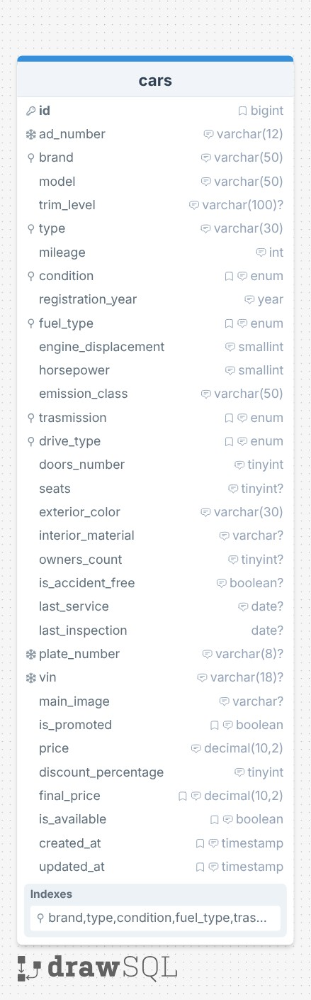

# DB First - Concessionaria Auto Usate

Questo progetto focalizza l'attenzione sulla **modellazione di un database** (approccio Database-First) per la gestione di un inventario di auto usate, ispirandosi a piattaforme come AutoScout24.

## 📌 Obiettivo dell'Esercizio

Modellizzare la struttura di una tabella capace di ospitare tutti i dati rilevanti per un concessionario, definendo correttamente i tipi di dato, le lunghezze dei campi (`VARCHAR`), gli attributi e gli indici.

## 🛠️ Strumenti Utilizzati

- **drawSQL**: Per la progettazione dello schema ER (Entity-Relationship).
- **SQL**: Per la definizione della struttura della tabella.

---

## 🏗️ Struttura del Database

### Tabella `cars`

La tabella principale che contiene i veicoli in vendita.

---

## 📋 Note Tecniche sulla Modellazione

- **Indici**: Sono stati aggiunti indici su `brand` e `type` per velocizzare le ricerche più frequenti effettuate dagli utenti.
- **Unique**: Il campo `vin` e `plate-number` sono stati impostati come `UNIQUE` per evitare duplicati accidentali di dati sensibili.
- **Precisione**: Per il prezzo è stato scelto `DECIMAL` per evitare errori di arrotondamento comuni con i tipi `FLOAT`.

---

## 📸 Schema del Database

_(Immagine esportata da drawSQL)_

